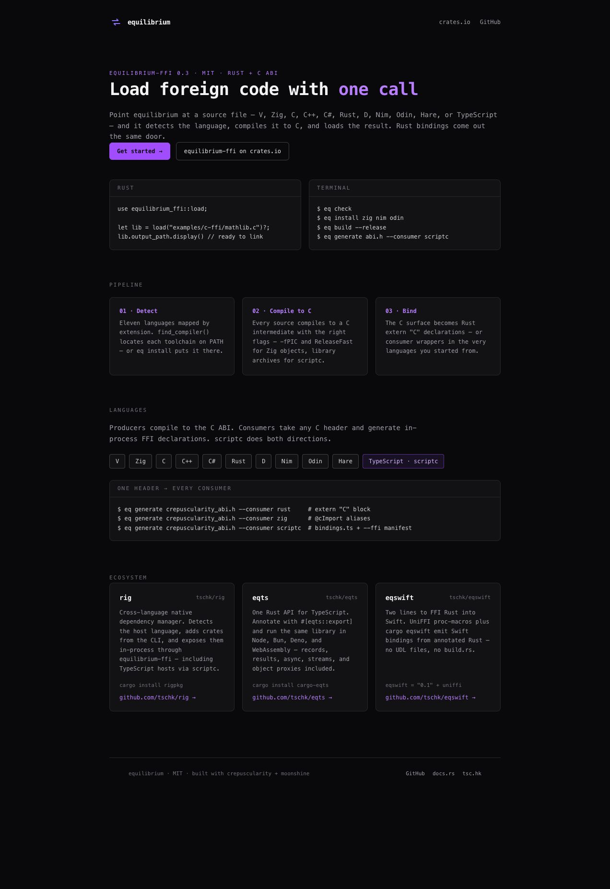
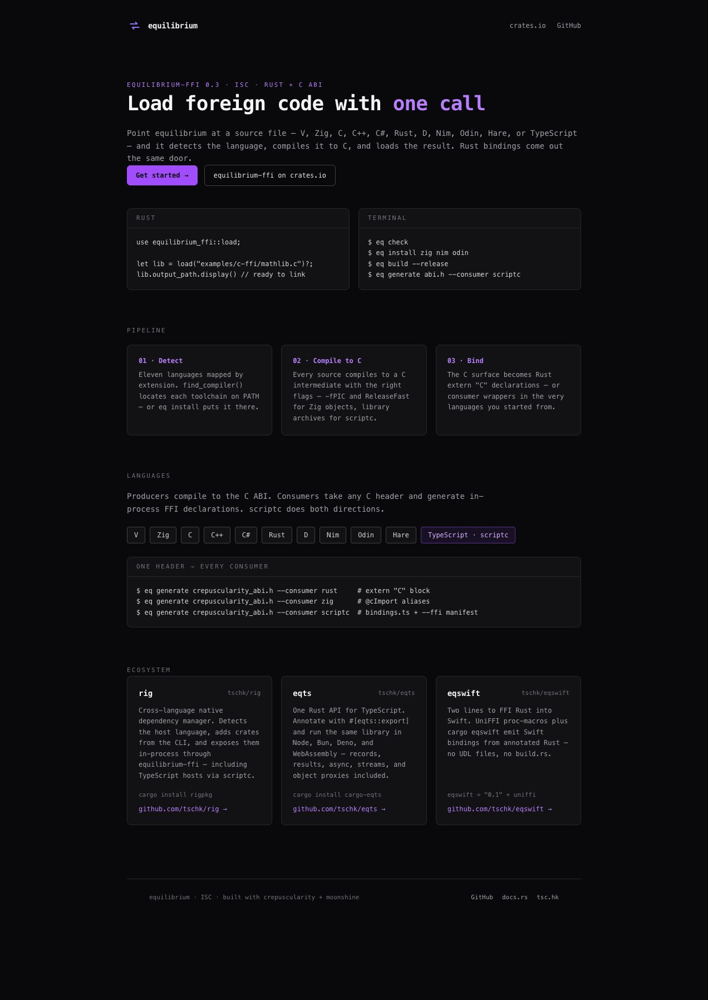

# Site license evidence

The canonical [LICENSE](../../LICENSE) is ISC, copyright (c) 2026 The Software Company of Hong Kong & Contributors.

Before: actual rendered https://eq.tsc.hk/ page, showing MIT in the hero and footer.

After: actual locally rendered corrected template at http://127.0.0.1:8765/. The HTML was generated with `bun scripts/build.tsx` using existing cached dependencies and the live public stylesheet. This is local verification, not deployment proof.

Validation: rendered HTML contains two ISC labels, no MIT label, and JSON-LD links to https://github.com/tschk/equilibrium/blob/main/LICENSE. Root LICENSE is byte-identical to the original. `git diff --check` and `cargo fmt -- --check` passed. Independent source review found no issues. No package downloads or full build were performed.

The existing Site workflow deploys on main pushes affecting site/**; this draft PR does not deploy production.
